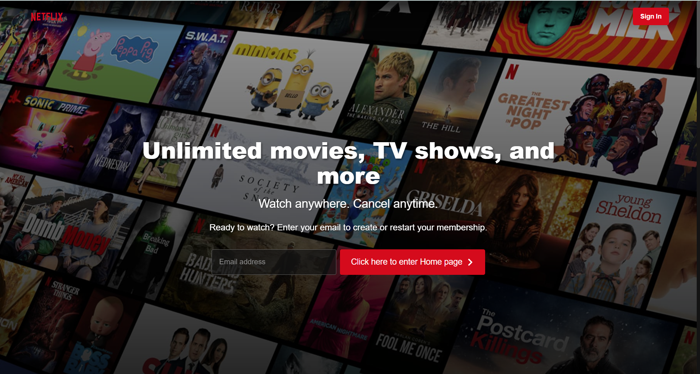
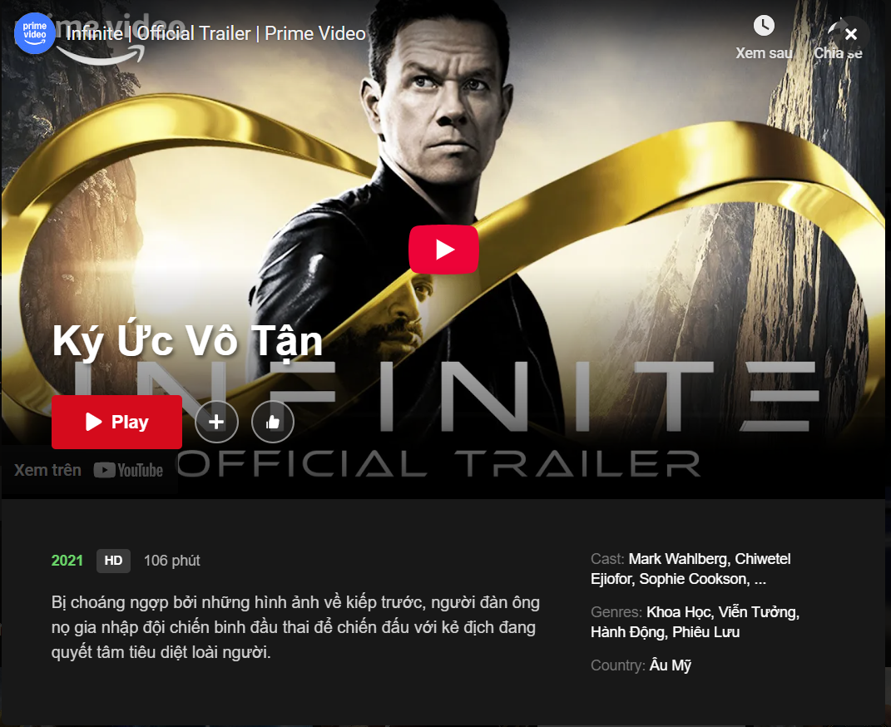
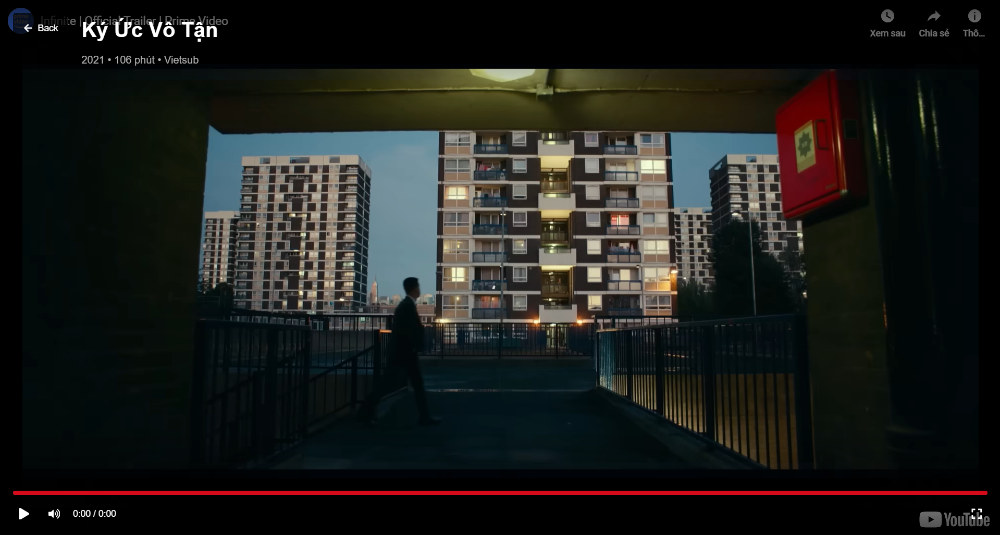

🎬 Netflix Clone
Một ứng dụng streaming video clone Netflix được xây dựng bằng React, cung cấp trải nghiệm xem phim tương tự Netflix với giao diện hiện đại và responsive.

📸 Screenshots

Landingpage

LoginPage

Homepage

Movie Player

SearchPage

✨ Tính năng chính
🏠 Trang chủ Netflix-style với hero banner và carousel phim
🎥 Video Player hỗ trợ phát video trực tuyến
🔍 Tìm kiếm phim thông minh
📱 Responsive Design tối ưu cho mọi thiết bị
🎭 Modal thông tin phim với preview và chi tiết
🎨 UI/UX giống Netflix với animations mượt mà
📂 Phân loại phim theo thể loại (Hành động, Tình cảm, Hài hước...)
🛠️ Công nghệ sử dụng
Frontend
React 18 - UI Library
React Router DOM - Routing
React Icons - Icon library
CSS3 - Styling với Flexbox/Grid
API & Services
Custom Movie API - Lấy dữ liệu phim
CDN Image Service - Tối ưu hình ảnh
📁 Cấu trúc dự án

netflix-clone/
├── public/
│   ├── images/
│   │   ├── Formula1.png
│   │   ├── device-pile.png
│   │   └── screenshot.png
│   └── index.html
├── src/
│   ├── components/
│   │   ├── Layout/
│   │   │   └── Header/
│   │   ├── MovieCard/
│   │   ├── UI/
│   │   │   ├── Button/
│   │   │   └── Modal/
│   │   └── ...
│   ├── pages/
│   │   ├── HomePage/
│   │   ├── WatchPage/
│   │   └── ...
│   ├── services/
│   │   └── api.js
│   └── App.js
└── package.json
🚀 Cài đặt và chạy dự án
Yêu cầu hệ thống
Node.js >= 16.0.0
npm >= 8.0.0
Cài đặt
Clone repository

git clone https://github.com/yourusername/netflix-clone.git
cd netflix-clone
Cài đặt dependencies

npm install
Tạo file environment

cp .env.example .env
Cấu hình API endpoints trong .env

REACT_APP_API_BASE_URL=your_api_base_url
REACT_APP_CDN_URL=your_cdn_url
Chạy development server

npm start
Ứng dụng sẽ chạy tại http://localhost:3000

📱 Responsive Breakpoints
Desktop: >= 1024px
Tablet: 768px - 1023px
Mobile: <= 767px
🎯 API Endpoints

// Lấy phim theo thể loại
GET /api/movies/category/{category}?limit={number}

// Tìm kiếm phim
GET /api/search?q={query}

// Chi tiết phim
GET /api/movie/{slug}
🔧 Scripts có sẵn

